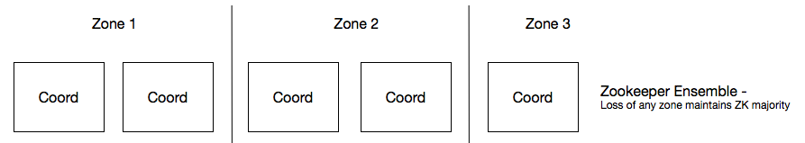

# Considerations for Availability and Redundancy
This article discusses underlying infrastructure failure tolerance for various components of the Apprenda Cloud Platform architecture.

## Platform Coordinators (Apache Zookeeper)
The platform uses [Apache Zookeeper](https://zookeeper.apache.org/) as the underlying key-value store for real time platform information such as topology, node state, workload states and transitions, and more.  Zookeeper is distributed with the platform installer and is configured automatically by the platform at install time.  The distributed nature of Zookeeper means that multiple machines will host the service and considerations should be made for the resiliency of the Zookeeper cluster (called an _ensemble_).  Generally, a sufficiently sized production installation of Apprenda should use five Zookeeper instances as described in the Zookeeper documentation:

>As long as a majority of the ensemble are up, the service will be available. Because Zookeeper requires a majority, it is best to use an odd number of machines. For example, with four machines ZooKeeper can only handle the failure of a single machine; if two machines fail, the remaining two machines do not constitute a majority. However, with five machines ZooKeeper can handle the failure of two machines.

More here:
<https://zookeeper.apache.org/doc/r3.3.2/zookeeperAdmin.html#sc_zkMulitServerSetup>

Therefore, when planning infrastructure for an Apprenda environment consider having 3 failure zones amongst the 5 Zookeeper machines. This should be in a 2-2-1 configuration:

With this configuration, the infrastructure can lose any single zone and maintain a majority.